

Click For Author Details
  

### 🖊 Author
---

**Full Name:** Isaac Maake  
**Current Focus:** AWS Cloud Engineering & AI/ML Systems  
**Special Interests:** Agentic AI, Machine Learning, Cloud Architecture, Pythonista, Sim Racing 🙂
**Based in:** Johannesburg, South Africa  
> “Building systems that turn ideas into scalable intelligence.”
---
**LinkedIn:** [LinkedIn](https://www.linkedin.com/in/isaac-maake-198910/) 
---

---
# AWS SimuLearn: File Systems In The Cloud

---
## 1. Goal
The Goal of the simulearn lab was to provide an AWS solution to assist a pet modeling agency to share files across its branch offices without managing the physical infrastructure.

### The Situation at the Company is as follows:

The pet modeling agency wants a way to share files across its branch offices without managing physical storage infrastructure. In the past year, they have established **three new company branches in the city**. Each branch has its own pet image server that connects to a local client management application. Each server stores images of all our pet clients along with informational metadata. We use a custom application to sync the client data across all three branches. But it takes too much time to access the images, and it's not always consistent. Our synching solution fails sometimes because one branch server might run out of storage space. We need a solution that centralizes our image storage and scales automatically. all branches access and update the same pet client files. And we have certain folders for our VIP clients that only our concierge team has access to.

#### The situation at the agency can be visualized as follows:
Click to expand the image

---
## 2. AWS Solution to the Agency's I.T issues
In summary, the agency's issues are centered around *Files Management and Storage*. Their other concerns regard latency issues, access management, synchronization, service availability, and scalability of resources as demand increases.

Amazon EFS meets the agency's requirements as follows"
- The agency can create *shared network drives* so that the branches can access pet client photos from a *central location*, instead of files and folders residing in discrete and isolated servers that need frequent syncing. With AWS EFS, storage is central and compute is distributed.
- They can *restrict access* with *file-level permissions* allowing the concierge team and the VIP client's maximum privacy.
- Amazon EFS provides *petabyte-scale storage* that *grows and shrinks* automatically as you add and remove files. This saves the agency money as they need not buy bigger storage for their servers or EC2 instances which they may not size appropriately (paying for unused storage)
- Amazon EFS is *highly available* and is designed for *99.999999999 percent durability*. Its a service that is always online and highly accessible/available.

### The Proposed AWS Solution
The proposed AWS EFS solution can be visualised below:

#### The solution is further explained below:
- A web server is provisioned to a nearby availability zone that is closer to each branch, to eliminate/deal with latency, and to be a dedicated server for a specific office only. 
- The EFS file system enables simultaneous access for EC2 instances (AWS servers) within your VPC (Your own isolated(rented) section of the cloud), facilitating rapid management of dynamic content. 
- A mount target is created for the EFS, that provides an IP address endpoint for instances to connect to the file system. Web servers mount the target from their respective AZ (availability Zones) as a local folder on the instance.
- Instances interact with the EFS file system as local storage, **with changes visible to all authorized instances**
- As the agency grows, **with more files and folders to be stored (and accessed), more branches opened world wide meaning more employees, clients and VIP clients**, the file system (AWS EFS) automatically scales based on data volume. The file system accommodates additional instances through mount target creation and attachment in the appropriate AZ.

### Implementing the AWS EFS Solution
The Workflow for creating an AWS solution (any solution actualy) for a client can be generally summarized as follows:
* Requirements Gathering - understanding the business.
* VPC Design - The company creates an AWS account for use with subnets in different AZ as needed.
* Security Design - e.g., Allow inbound NFS (TCP 2049) only from EC2 instances selected (EFS security). Create EC2 security groups to allow out bound to EFS and inbound from company's ip addresses.
* Create the EFS File system - Create the file system and configure it according to the client's requirements (naming, Encryption at rest, performance, throughput mode(bursting/provisioned)), etc
* Create Mount Points/targets per AZ
* Create EC2 instances - for each AZ. Attach roles or security groups as needed.
* Mount EC2 to EFS - via CLI in the management console.
* Solution Testing - simulate the client's day to day work and verify to ensure alignment with the requirements and that the client's needs are met. Simulate multi-instance file sharing across AZ'z, permission rules, performance under load, etc.
* Project Sign Off and Recommendations - If the cloud architect (practitioner in this case🤦‍♂️) AWS solution met the requirements and the client is satisfied/happy, the client will sign-off the requirements document again and any work done on the project that was recorded by the Business Analyst.

In this Simulearn task, the workflow will not be followed as described above as some resources have already been created for us. Below I cover the work done / lessons covered in the lab as arranged, although you will notice that all the steps of the workflow were covered except the last two workflows. *The process of creating an AWS account and logging in wont be covered here.*

1. Requirements Gathering : business first! Know the client's needs/problems/pain points with regards to their solutions/services. Gather all the details about their services features (latency rewuirements, security, availability etc) in order to make an informed decision about the suitable AWS services that will meet their needs. At the end of this process, a requirements document is created, shared, and agreed upon.

The Agency's pain points have been identified in the [Goal Section](#the-situation-at-the-company-is-as-follows). We will not create a proper requirements document for this scenario as it has quite few pain points and for an AWS practitioner, the solution is straight forward. The solution is provided in [Section 2](#2-aws-solution-to-the-agencys-it-issues).

2. In the Simulearn environment, three EC2 instances were already created for us each in its designated AZ is US-East. We assume the agency's branches to be in the region US-East and closer to the assigned AZ.
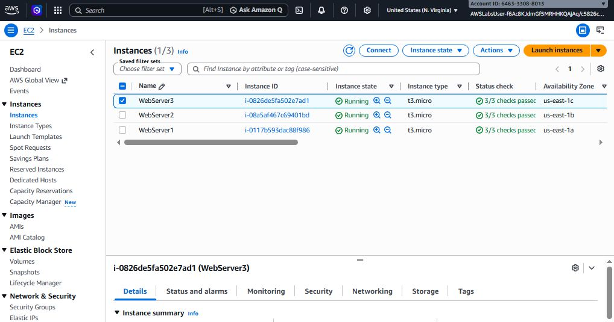

The webservers were already configured with a security group, were in a running state, and and were of a t3.micro type (suitable for labs mainly).
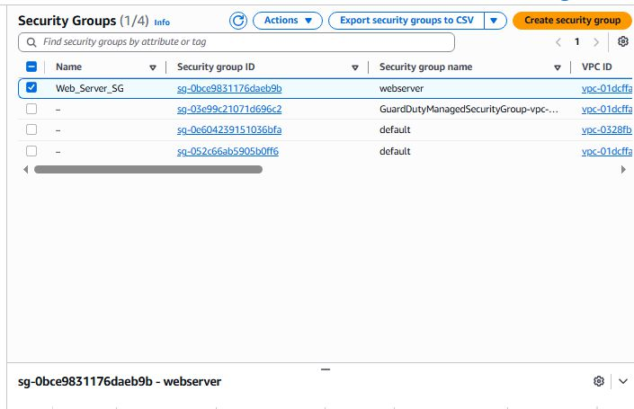

The security group for the EFS service was also created as well. It contains 1 inbound and outbound rules, and it restricts access to web servers only. 
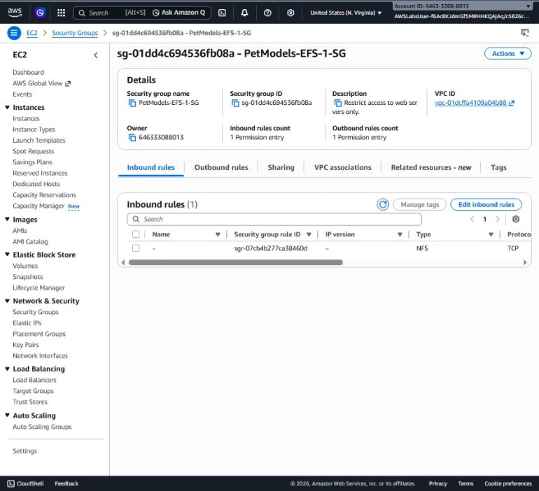

3. The next task was to create the AWS EFS system from the management console. Clicking the "Create File System" allows us to proceed further to create and configure the EFS.
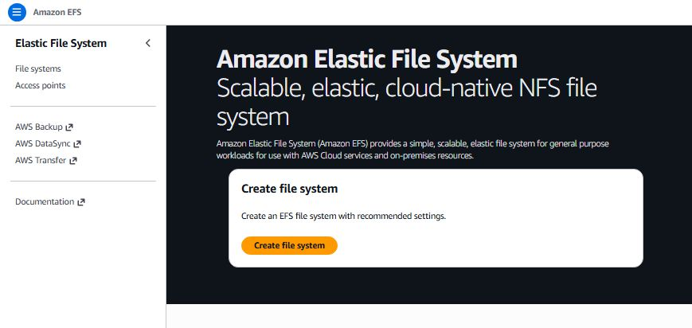

On the modal shown below, provide the name and the vpc to be used by the EFS, then click "Customize" to add more configurations:
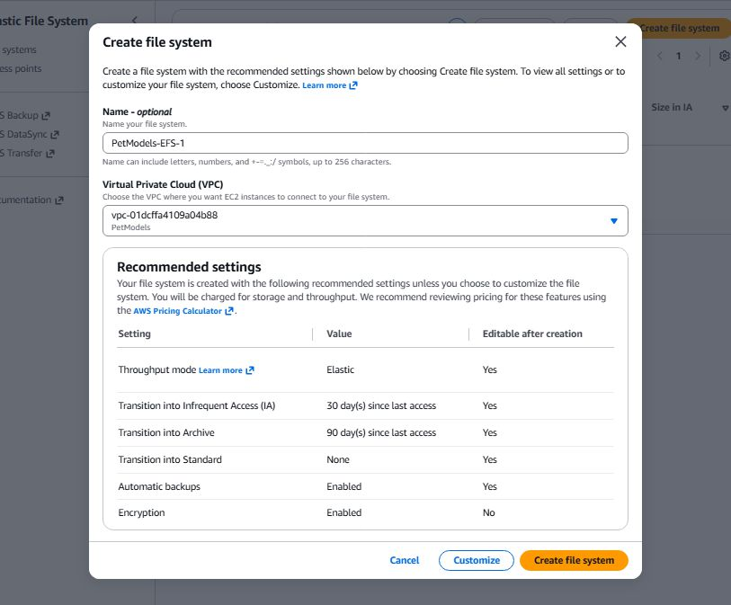

Next we go through some predefined steps in the Management Console to configure and create the EFS service. The steps are as follows:

* File System Settings - name, we configure the EFS by providing the names and selecting the services/features that will meet our client's needs. The following configurations were made/selected: 
- 
    - The name - A clear, unique and sound name was chosen.
    - A regional file system type to support the agency's branches across the region
    - Auto-Backups and life cycle management option were not selected as the client did not mention them.
    -  The bursting throughput mode was selected for throughput to scale with the workload. 
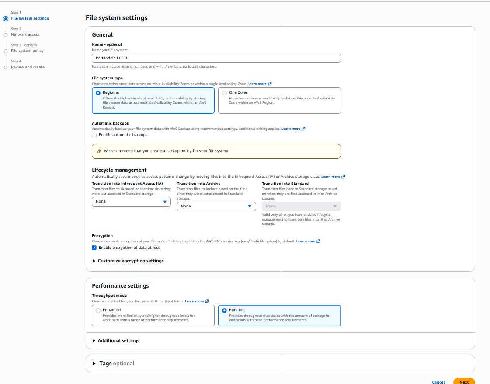

* Next, we setup the Network Access - The VPC of the pet models agency was selected, as well as the mount targets for all the three web servers. The mount targets specify the AZ, security groups, and the related vpc details. If a mounting target for a specific AZ is not added, the web servers in that AZ will not connect to the EFS.  **NB**: *Only two are shown the image below*, but all three mount targets were created for the Webservers in the different AZ's, to meet the agency's need for all the 3 company branches. 

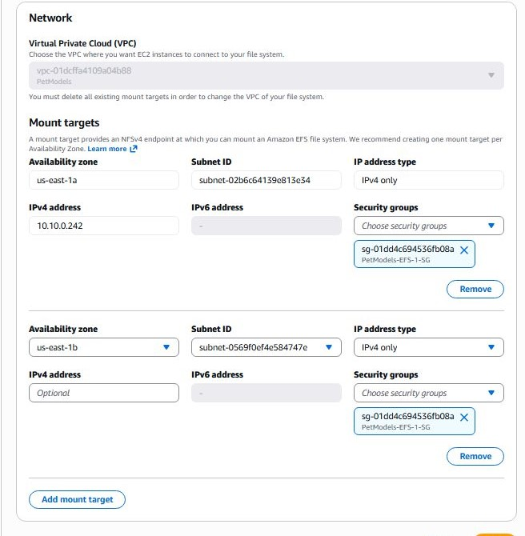

**NB**: *You have to wait for the status of the mount point to change to **available** before it can be used for mounting.* See the image below:

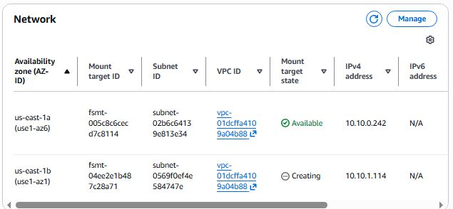

* Next, we configure the File System Policy. Although this step was skipped in the lab, its a very important step as it aligns with the client's requirements. As the agency already mentioned that other employees have access to specific folders and that the concierge team and VIP clients have access to specific folders, this step allows us to meet that requirement. On the file system policy step, the following can be configured, to name a few:
    * Prevent root access - no user can gain root access and modify system level files or execute system wide commands
    * Other employees can be given access to their specific folders and be restricted to VIP folders.
    * Concierge team can be allowed access to all folder types.
    * VIP clients can be allowed access to VIP folders only.
    * Prevent anonymous access to maximise the File System security.
    * Enforce encryption rules for(specific) files and/or folders.

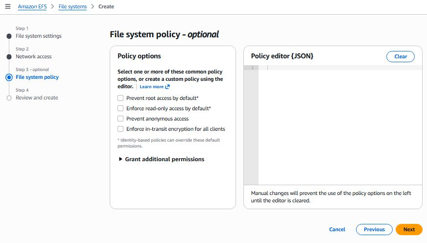

This step is very crucial and AWS must include it in the future to give practitioners a real experience of how policies work! Without file system policy anyone with network access could mount the EFS! Combining security groups and file system policies ensures maximum security.

* The next Step is to Review and Create the EFS. The page simply provides all the configs you made in one page for review. If all is well, simply click the "Create File System" button. 

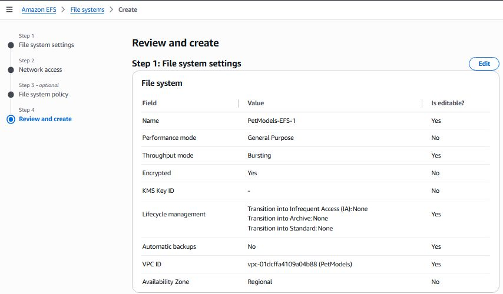

Thus 4 steps were followed to confifure the EFS: **File system settings, Network Access, File System Policy, and Review**. 

When the EFS is created, wait for its status to change to available! 

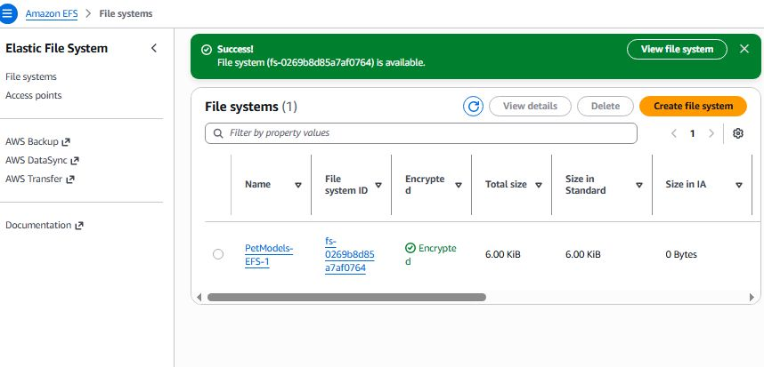

4. Mount EFS on EC2.
* To proceed, open the EFS page which provides more details and functionality to use and configure EFS.

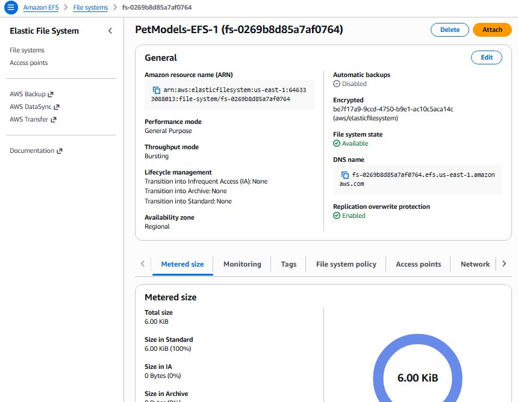

Click "Attach" button on the above page to access some important info.

* To mount EFS on EC2, configure the EFS to mount via DNS and note the CLI command to create a mounting point on EC2 using the EFS mount helper.

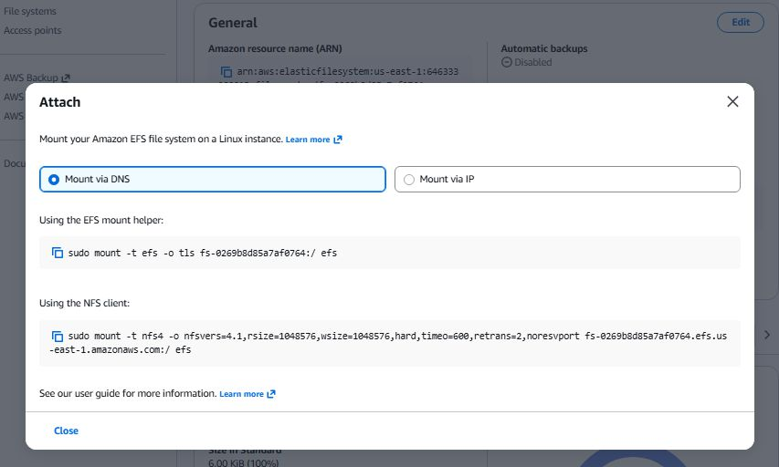

We made use of the EC2 instance's SSH Session Manager to connect and configure the instances and to create a mounting point. The following tasks were completed on each web server, via the ssh session manager CLI and root access, in order to mount the EFS to the web servers successfuly:
* 
    * Installing the amazon EFS utilities - an official AWS package that makes mounting and using the EFS from linux instances easy.
    
    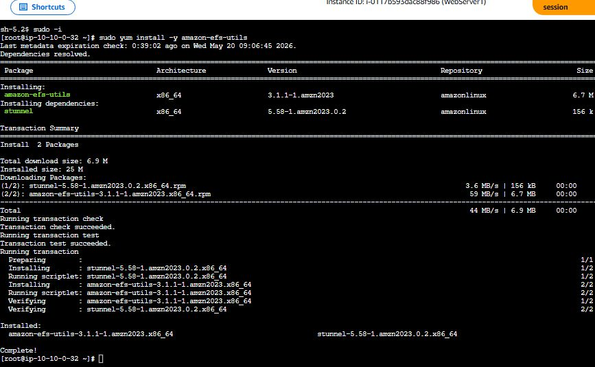

    * Created a "data" folder on each instance - this is the folder that is used as the mounting point for all the instances. This means that the data folder becomes the entry point to the EFS system, meaning its the specific location where EFS is accessible. Since all instances were mounted on the same directory location (data dir), all instances will see the same files. For our agency client, all photos and folders will be accessed and stored in the EFS via the data directory.
    * A mount cli command  was excuted to allow the EFS to mount the EC2 via the data directory.
    * A log file was created inside the folder to log a record whenever the EFS was successfuly mounted on the EC2. *See the image below which shows the contents of the log file from Webserver 3, even though the log file's line 1 and 2 were added by separate web servers where the log file resides separately.*

    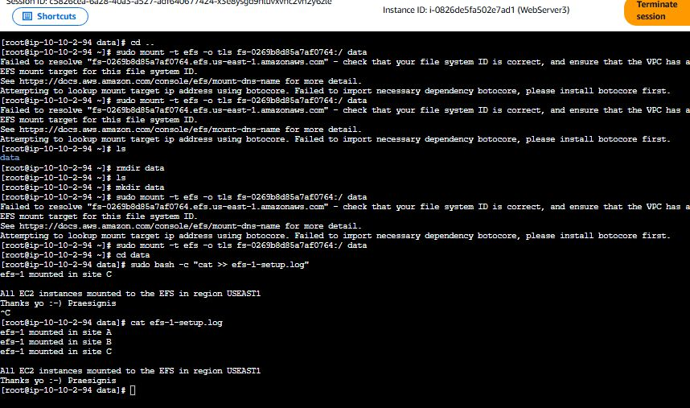
---
## 3. Challenge Completed
The challenge was completed successfully and a completion certificate was awarded 🙂.

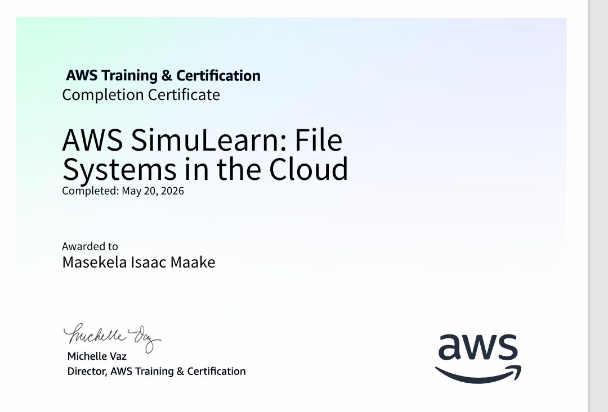
---
## 4. Lessons Learnt
Below I would like to reflect on some things I learnt and found helpful.
* Understanding the client problem very well will allow an AWS Cloud practitioner to provide a better AWS solution to the client that is cost effective and aligned to the business needs without surprise costs.
* EFS File Policy setup is a must if a company has different employee roles, clients, and applications that access the EFS for various reasons.
* Mounting the EFS on the same path of each EC2 instance makes file sharing easier because all instances see the same files. Data (folders, photos, and files) are consistent across the servers, all branch offices see/access the same files, syncronization is no longer an issue. Ensure that you mount to an empty path.
---
## Lab Details

Click To Expand

**Lab link** -> [link](https://skillbuilder.aws/learn/A5M8X2CHM3/aws-simulearn-file-systems-in-the-cloud/)
Search for *AWS SimuLearn: File Systems in the Cloud* on AWS SkillBuilder
**Completed On**: 20 May 2026
**Course Details**: AWS re/Start with **Praesignis**(AWS SA Partner)

---
  

